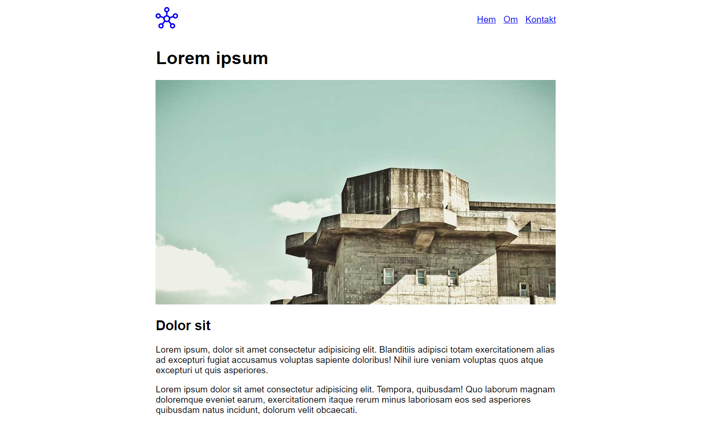
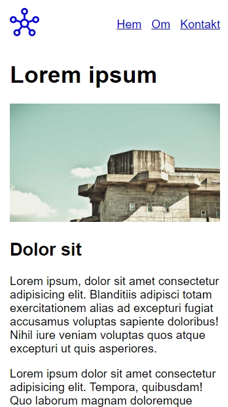

# ulf-projekt-uppgift-2

Skapa en webbsida med **centrerad layout**, sidan bör vara responsiv.

* Navbar med länkar
    * Logga, placeras till vänster
    * Meny, placers till höger
        * Hem
        * Om
        * Kontakt

* Main med innehåll
    * Rubrik
    * Bild
    * Underrubrik
    * Paragrafer med text

# Instruktioner

## Parprogrammering

Er uppgift är att fortsätta designa sidan från den centrerade layouten.
Ni ska nu skapa en fungerande navigation och tillhörande sidor (om / kontakt)

* Navbar med länkar
    * Logga, placeras till vänster använd en ikon från https://fonts.google.com/icons
    * Meny, placers till höger
        * Hem
        * Om
        * Kontakt
        
## Parsons

Dina instruktionsfiler finns i mappen parsons/.
Du ska utifrån dessa filera skapa en sida med centrerad layout. Du behöver redigera båda filerna (index.html och style.css) och ta bort överflödig/onödig/felaktig html/css.

## Flödeschema

Utgå från skisserna.

